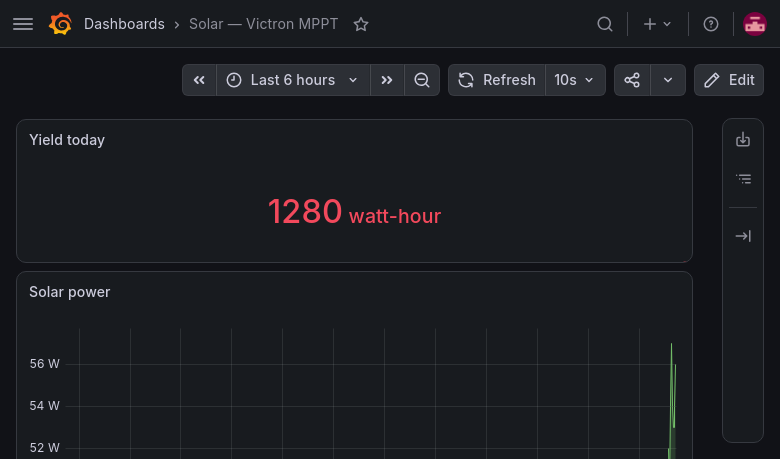
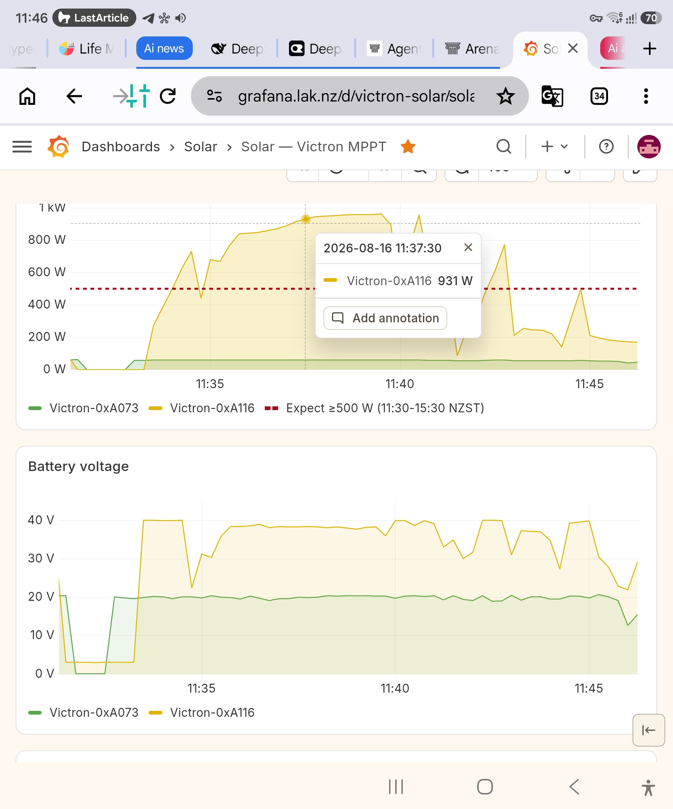
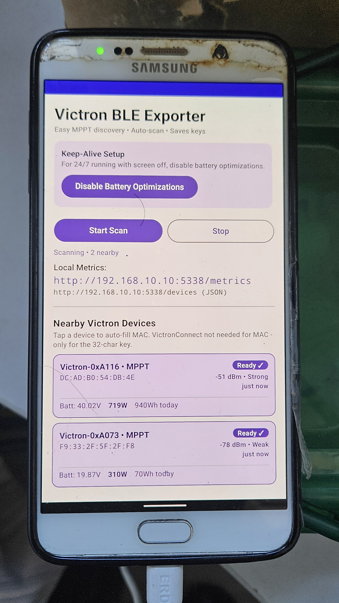
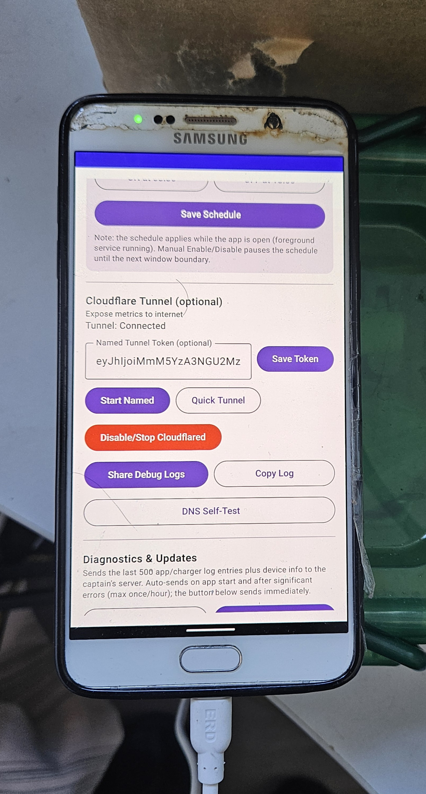
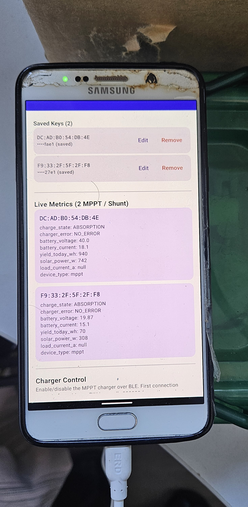
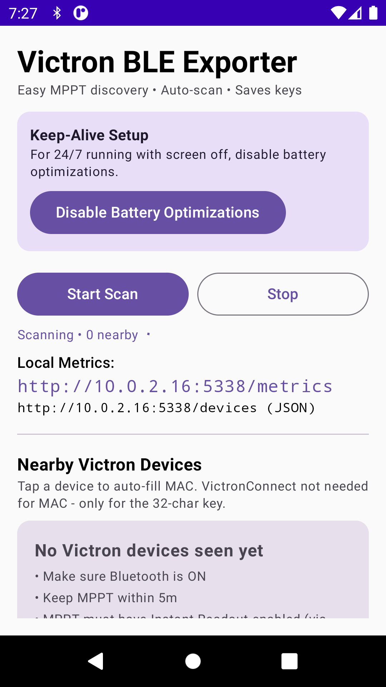
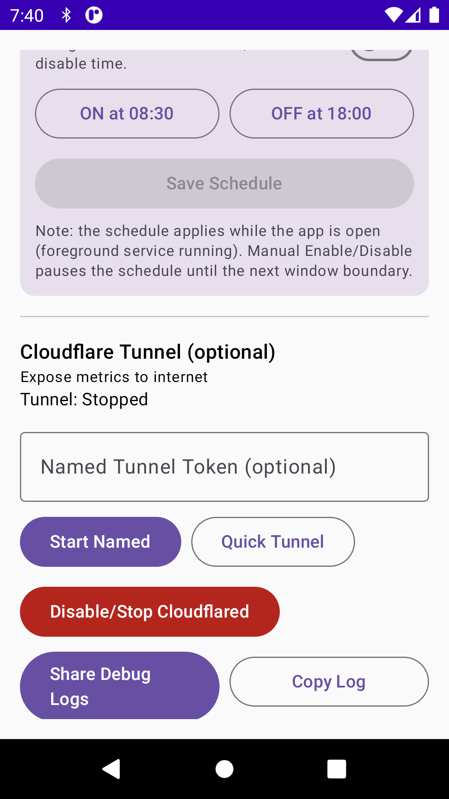

# Victron BLE Exporter

**Turn an old Android phone into a wireless bridge from your Victron MPPT to Prometheus + Grafana — no port-forwarding required.**

[](https://github.com/lakshaysethi2/victron-bland-exporter/actions/workflows/ci.yml)
[](https://github.com/lakshaysethi2/victron-bland-exporter/releases/latest)
[](guide.md#install-the-app)
[](LICENSE)
[](app/src/main/kotlin/com/lakshaysethi/victronbleexporter)
[](guide.md#how-it-works)

The app runs on an old Android phone next to your Victron MPPT or SmartShunt, reads the BLE **Instant Readout** broadcasts, decrypts them with the key from VictronConnect, exposes a Prometheus `/metrics` endpoint — and publishes it to the internet through a **built-in Cloudflare Tunnel**, so your Prometheus server can scrape it from anywhere over HTTPS.

```
Victron MPPT (BLE) → Android phone (this app) → cloudflared tunnel → Prometheus → Grafana
```

> ✨ **The hard part is done for you:** the bundled `cloudflared` is a custom **cgo/NDK rebuild** so its child-process DNS actually works on Android — a notorious failure mode that kills every stock static build (see [the `[::1]:53` story](guide.md#the-153-child-dns-failure-the-hard-won-one)).

---

## Screenshots

**Grafana dashboard** — imported in one click from [`deploy/grafana-dashboard.json`](deploy/grafana-dashboard.json):



Live dashboard on a phone browser:



**Hardware** — the exporter runs on a low-cost spare Android phone placed near the MPPT charger:

| Device near MPPT | Device near MPPT | Device near MPPT |
|---|---|---|
|  |  |  |

**App** — main screen and debug-log sharing:

| Main screen | Debug log |
|---|---|
|  |  |

---

## Quick start

The full, beginner-friendly walkthrough is in **[`guide.md`](guide.md)** — build the APK, sideload, set up the tunnel, configure Prometheus, and import the Grafana dashboard, end-to-end.

1. **Build & install** — download [victron-ble-exporter.apk](https://github.com/lakshaysethi2/victron-bland-exporter/releases/latest/download/victron-ble-exporter.apk) from the latest [GitHub Release](https://github.com/lakshaysethi2/victron-bland-exporter/releases/latest), or `./gradlew assembleDebug`, then sideload on any arm64 Android 8+ phone ([instructions](guide.md#build-the-apk))
2. **Add your key** — grab the 32-char Instant Readout key from VictronConnect ([how](guide.md#get-your-victron-encryption-key))
3. **Start the tunnel** — quick tunnel for testing (`https://your-subdomain.trycloudflare.com`), named tunnel for a stable hostname ([setup](guide.md#set-up-the-tunnel))
4. **Scrape it** — 5-second HTTPS scrape job in Prometheus ([config](guide.md#configure-prometheus))
5. **Dashboard** — one-click Grafana import of [`deploy/grafana-dashboard.json`](deploy/grafana-dashboard.json) ([instructions](guide.md#set-up-grafana--import-the-dashboard))

---

## Features

- 🔄 **BLE → Prometheus in real time** — full [keshavdv/victron-ble](https://github.com/keshavdv/victron-ble) Instant Readout parser (AES-128-CTR) for MPPT solar chargers and SmartShunt battery monitors
- 🌐 **Cloudflare Tunnel with working child DNS** — embedded `cloudflared`, rebuilt with cgo/NDK so DNS resolves through Android's netd instead of dying on the loopback `[::1]:53` trap
- 📈 **Prometheus `/metrics` endpoint** (OpenMetrics, port 5338) — voltage, current, solar power, yield today, **panel voltage**, state of charge, charge state, RSSI, device count; Instant Readout gauges and `victron_devices_total` drop after 90s without a new advertisement (`victron_up` / `victron_last_seen_timestamp` stay so a lost BLE link is visible)
- ⚡ **Charger control over BLE** — enable/disable the MPPT charger (register `0x0200` device mode via the VictronConnect GATT service) with visible state, readback verification, and a configurable daily on/off schedule (default 08:30 → 18:00, re-applied every 10 minutes while the exporter is up)
- 🔋 **Battery / voltage control over BLE** — read and set battery system voltage (register `0xEDEF`, e.g. 12/24/48 V), absorption / float / equalisation voltages (`0xEDF7`/`0xEDF6`/`0xEDF4`) and live charger voltage (`0xEDD5`) over the same GATT service, with confirmation dialogs and metrics
- 🌐 **Remote charger + voltage control** — flip the charger, set voltages, paste an Instant Readout key, save/start/stop the named Cloudflare tunnel, or restart BLE scanning from any browser at `https://mppt.lak.nz/` (`/charger` and `/voltage` also work) or `http://<phone-ip>:5338/` (LAN), protected by a shared secret you set in the app; the control page shows whether the named tunnel is up and how long since the last BLE advertisement
- 🖥️ **Importable Grafana dashboard** — [`deploy/grafana-dashboard.json`](deploy/grafana-dashboard.json): solar power, battery voltage/current, **panel voltage**, yield, devices online
- 📤 **Remote diagnostics + in-app updates** — Send Diagnostics posts the last 500 app/charger log lines to [mppt-logs.lak.nz](https://mppt-logs.lak.nz); Check for Updates reads `/api/latest.json` and the public [GitHub Release](https://github.com/lakshaysethi2/victron-bland-exporter/releases/latest) and offers whichever has the higher versionCode
- 🐞 **Share Debug Logs** — one tap bundles the last 200 cloudflared lines, exit code, network-bind/DNS preflight, and a DNS self-test report, with clipboard fallback — *the* tool for diagnosing tunnel issues
- 🔍 **DNS Self-Test button** — verifies on-device that the bundled binary is the dynamic cgo build (fails hard if a static binary sneaks back in)
- 📱 **Easy discovery UX** — auto-scans nearby Victron devices, tap to auto-fill the MAC, paste the key
- 🔋 **Runs unattended** — foreground service, auto-start on boot, named-tunnel restore after a cloudflared crash, battery-optimization handling, multi-device support
- 🌳 **Open source (MIT)** — no cloud dependency for the app itself; quick tunnels need no account at all

---

## Charger Control (enable / disable + schedule)

The MPPT advertises live data through the read-only Instant Readout protocol, but **charger on/off is a write** to the proprietary VictronConnect GATT service:

- Service `306b0001-b081-4037-83dc-e59fcc3cdfd0` (legacy SmartSolar protocol), characteristics `306b0002` (control), `306b0003` (commands), `306b0004` (bulk)
- Register `0x0200` **device mode**: `1` = Charger on, `0` or `4` = Charger off; `0xEDEF` **battery voltage setting** (un8, V), `0xEDF7`/`0xEDF6` **absorption/float** (un16, 0.01 V) and friends — all from Victron "BlueSolar HEX protocol" / Mrkvak `mppt_registers.json` (VictronConnect APK metadata)
- Read frame `05 03 81 19 <reg>`, write frame `06 03 82 19 <reg> 41 <value>`, response `08 03 19 <reg> 41 <value>` (device-mode example: `05 03 81 19 02 00` / `06 03 82 19 02 00 41 <mode>`)  

In the app's **Charger Control** section:
1. Enter the MPPT's MAC (auto-filled from your saved devices).
2. Tap **Enable Charger** / **Disable Charger** — the app connects, runs the session handshake, writes the mode and reads the value back so you see the resulting device state (also in **Share/Copy Debug Logs** under "Charger control").
3. **Read Current State** refreshes the displayed state without writing.
4. Optionally enable the **daily schedule** (on time / off time, defaults 08:30 / 18:00). The service re-checks and applies it every 30 seconds while running; a manual Enable/Disable pauses the schedule until the next window boundary (shown in the UI).

The current state is exposed as the `victron_charger_enabled` metric (`1` = charger on, `0` = off, `-1` = unknown). Voltage settings are exposed as `victron_battery_voltage_setting_volts`, `victron_absorption_voltage_volts`, `victron_float_voltage_volts`, `victron_equalisation_voltage_volts`, `victron_charger_voltage_volts`. While the exporter is running it also reads solar **panel voltage** (register `0xEDBB`, ~every 60 s) and serves it as `victron_panel_voltage_volts` — Instant Readout does not carry it; a night-time `0xFFFF` or a value older than 5 minutes is omitted rather than left stale.

### Voltage settings (battery system voltage + charge voltages)

The **Voltage Settings** card in the app lets you read and write the battery-related settings that otherwise require VictronConnect:

- **Battery system voltage** (`0xEDEF`, un8 volts) — the "20V / 40V mode" referenced in issue #13 (common values 12/24/48, device-dependent).
- **Absorption / float voltages** (`0xEDF7` / `0xEDF6`, 0.01 V) and equalisation (`0xEDF4`) plus live charger voltage (`0xEDD5`).

All writes go over the same BLE GATT service as charger on/off, with a confirmation dialog in the app and readback verification in **Share Debug Logs**. The same registers are reachable remotely: `GET /voltage` returns `{battery_voltage_setting, absorption_voltage, float_voltage, …}` and `POST /voltage` accepts any subset of those fields (auth required, same remote secret as `/charger`). The web shell at `https://mppt.lak.nz/voltage` mirrors the app card.

### Remote control (browser / tunnel)

In the app's **Remote Charger Control** section, enable remote control and set a secret (min 8 chars). The app then serves:

- `GET  /charger` — mobile control page (login shell; everything on it requires the secret)
- `GET  /charger/status` — JSON state (`mode`, schedule times, phone local time/zone, live Instant Readout watts/volts, sighted BLE devices with needs-key / wrong-key, last charger debug lines, app version, last GATT voltages, `lastBleAdAt`, …); kicks a live ON/OFF read when mode is still unknown after a reboot
- `POST /charger` — `{"action":"on"|"off"|"read", "mac"?: "AA:BB:..."}` flips the charger or reads live ON/OFF over GATT (body mac, else stored, else first live Instant Readout)
- `POST /charger/schedule` — `{"enabled":true,"enable":"08:30","disable":"18:00", "mac"?: "AA:BB:..."}` saves the daily window
- `POST /charger/key` — `{"mac":"AA:BB:...","key":"<32 hex>"}` saves an Instant Readout key on the phone (never echoed)
- `POST /charger/tunnel` — `{"token":"..."}` saves and starts the named Cloudflare tunnel, or `{"action":"start"|"stop"}` uses the token already on the phone (never echoed)
- `POST /charger/scan` — restarts BLE scanning so a quiet Instant Readout can be poked without opening the phone
- `GET  /voltage` — JSON voltage settings; `POST /voltage` writes battery/absorption/float

Auth: every status/command call must send the secret as an `X-Remote-Secret` (or `Authorization: Bearer`) header. It is compared constant-time and **never logged or placed in a URL**; the page keeps it only in the browser session. When remote control is disabled, `/charger*` and `/voltage` answer 404. A remote flip or voltage write goes through the same service path as a local tap, so it gets the same BLE readback verification.

Pairing: the first connection prompts for a Bluetooth PIN. Use the PIN printed on the product sticker, or `000000` (the common Victron default).

> The daily charger schedule runs while the exporter notification is showing. Leave the app open or swipe it away — the service stays up (disable battery optimizations for overnight). Manual Enable/Disable still pauses the schedule until the next window boundary.

---

## Architecture

```
┌──────────────────────────┐     BLE 0x02E1 (Instant Readout)
│  Victron MPPT / SmartShunt│ ────────────────────────────────┐
└──────────────────────────┘                                  ▼
                                    ┌─────────────────────────────────────────┐
                                    │  Android foreground service (this app)  │
                                    │                                         │
                                    │  BLE Scanner → VictronParser (AES-CTR)  │
                                    │        → MetricsStore → /metrics :5338  │
                                    │                                         │
                                    │  cloudflared (cgo/NDK, bundled .so)     │
                                    │    └─ quick tunnel  /  named tunnel     │
                                    └───────────────────┬─────────────────────┘
                                                        │ HTTPS (Cloudflare Tunnel)
                                                        ▼
                                    ┌─────────────────────────────────────────┐
                                    │  Prometheus (scrape: 5s, /metrics)      │
                                    │        → Grafana (imported dashboard)   │
                                    └─────────────────────────────────────────┘
```

Key files:

```
app/src/main/kotlin/com/lakshaysethi/victronbleexporter/
├── parser/            VictronParser.kt, BitReader.kt, DeviceEnums.kt   (BLE decryption)
├── charger/           ChargerController.kt, ChargerProtocol.kt         (on/off + voltages)
├── exporter/          PrometheusExporter.kt, RemoteChargerHttp.kt      (/metrics + remote)
├── tunnel/            CloudflaredManager.kt, TunnelNetworkPrep.kt,
│                      TunnelBinaryInspector.kt                         (tunnel + DNS)
├── data/              DeviceRepository.kt, RemoteChargerStore.kt       (keys + remote secret)
└── service/           VictronBleExporterService.kt                     (foreground service)
app/src/main/jniLibs/arm64-v8a/libcloudflared.so                        (bundled binary)
```

---

## Project status

Core functionality is complete and battle-tested on real hardware: BLE parsing, Prometheus export, tunnel with working child DNS, named-token restore, charger schedule, remote `/charger` management, and the Grafana dashboard. Community help welcome on:

- More device types (Inverter, DC/DC converters, etc.)
- F-Droid packaging / signed release APKs (debug APK already ships on [GitHub Releases](https://github.com/lakshaysethi2/victron-bland-exporter/releases/latest))
- Test reports from other Victron hardware

## Contributing

PRs welcome — see [`guide.md`](guide.md) for the build and the cgo/NDK cloudflared recipe if you touch the tunnel binary. Please run the JVM unit tests (`./gradlew testDebugUnitTest`) — CI runs the same job plus a public-tree hygiene check, uploads a debug APK artifact, and on `main` publishes it to [GitHub Releases](https://github.com/lakshaysethi2/victron-bland-exporter/releases/latest). `TunnelBinaryInspectorTest` guards the bundled binary's linkage. Open issues with the bug template; never paste a tunnel token, Instant Readout key, or remote secret — see [`SECURITY.md`](SECURITY.md).

## License

[MIT](LICENSE) — parser logic ported from [keshavdv/victron-ble](https://github.com/keshavdv/victron-ble) (also MIT).
